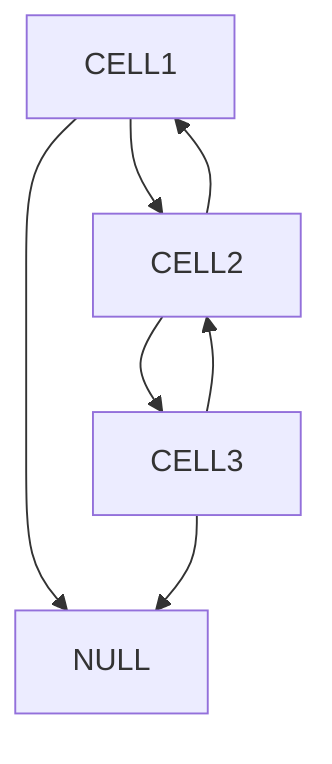

# Conway's Game

You will find an implementation of the Conway's Game in C.
## Raylib

To be able to compile and run the game you have to download **[Raylib](https://www.raylib.com/)**. Once you have dowload just follow instruction on **[The Official github repo](https://github.com/raysan5/raylib)**.

## Compile time
```shell
gcc -L/user/local/lib -o main main.c conway.c -lraylib
```
<font color="red">*Warning: Don't forget to put raylib.so in /user/local/lib directory*</font>

## Rules
[Wikipedia](https://en.wikipedia.org/wiki/Conway%27s_Game_of_Life)  for more details.
```
The universe of the Game of Life is an infinite, two-dimensional orthogonal grid of square cells, each of which is in one of two possible states, live or dead (or populated and unpopulated, respectively). Every cell interacts with its eight neighbors, which are the cells that are horizontally, vertically, or diagonally adjacent. At each step in time, the following transitions occur:

1. Any live cell with fewer than two live neighbours dies, as if by  underpopulation.

2.Any live cell with two or three live neighbours lives on to the next generation.

3.Any live cell with more than three live neighbours dies, as if by overpopulation.

4.Any dead cell with exactly three live neighbours becomes a live cell, as if by reproduction.
```

## Genese

I have decided during the summer vacation to experiment my level of coding without any AI assistant. 
In 2022-2023 maybe, I have seen a video about the [Conway's Game](https://www.youtube.com/watch?v=S-W0NX97DB0).

### First idea of implementation

If you have readed the rules. You have seen at the first line ***"The universe of the Game of Life is an infinite, two-dimensional orthogonal grid of square cells"***. Infinite ? 

So the main idea is that the principal information is store into the cells which are alive. Blacks cells in our case. So I have used double linked list to do treatment on each live cells.


Like that I use pointer in C. So for each iteration for the third rules I just go through the linked list and I search for it cells around it. And I apply the rules. <br>If the cell have to die next round I store it coordinate into an array of Vector2D. For the fourth rule, for each dead cells that are around live cell I re- use a function to it cells around it. And I apply the 4 rule. I store each new cells in an array of Vector2d.<br>
After that I just add and delete each cells follow the array of coordinate. I use this implementation for one iteration. 

## Code
All the utilities are in the Conway.h file.
### TODO 08-29-2024

- Make a builder of cell before starting the game
- Rework the algorithm to be more efficient
- Make a smooth navigation and block the dezoom 
- Question?